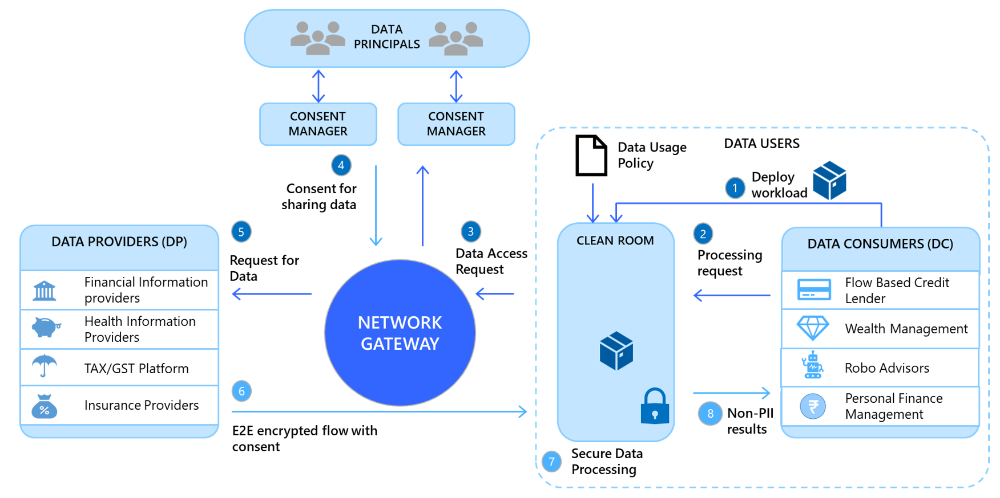
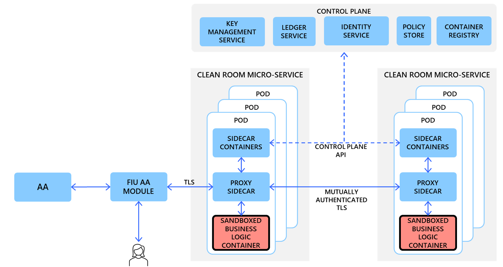

# Confidential Clean Room Services for DEPA
### Architecture Guidelines
### Version 1.0

## Summary

Confidential clean rooms are a new privacy construct in DEPA which enforce that data is only used in accordance with the data principal’s consent. This document proposes guidelines for enabling data processing services to be hosted in confidential clean room environments. 

## Glossary

| | |
|----------------|--------------------------------------------------|
| DEPA | Data Empowerment and Protection Architecture |
| DC | Data Consumer |
| FIU | Financial Information User |
| FIP | Financial Information Provider |
| CM | Consent Manager |
| AA | Account Aggregator |
| TEE | Trusted Execution Environment |
| CCR | Confidential Clean Room |
| CRS | Clean Room Service |
| CRMS | Clean Room Micro-service |
|||

## DEPA, Privacy and Compliance

The Data Empowerment and Protection Architecture or DEPA enables sharing personal data held by one or more data providers with data consumers with the consent of the data principal. DEPA introduces the notion of a consent manager that is responsible for interfacing with data principals, obtaining informed consent to retrieve their data from data providers, and to share that data securely with data consumers. The Account Aggregator, OCEN and the recently launched Unified Health Interface are the first instances of DEPA. The Account Aggregator and OCEN enable scenarios such as flow-based lending, where a borrower (an individual or an MSME business) can obtain uncollateralized credit based on cash-flow information such as bank statements and GST. 

As it stands, there are a few challenges with DEPA. The first is the potential for data misuse. With DEPA, any data consumer can easily obtain personal data and subsequently misuse the data in violation of consent. The risk of misuse is significantly higher in frameworks like OCEN where data is exposed to multiple data consumers. Today, there is no mechanism to enforce that all data consumers process data strictly in accordance with declarations made by the data consumer in the consent request e.g., for the purpose and lifetime defined in the consent request. To some extent, this problem is addressed by mandating compliance and audit, which limits participation to a select set of regulated entities. As DEPA evolves and number of data providers and consumers, and is used for sharing different kinds of data, concerns regarding data misuse will only grow.

A second related challenge is data over-collection. Using the consent mechanism provided by DEPA, it is easy for a data consumer to ask for more data than what is strictly required for the service being offered to the data principal. It is envisaged that data consumers will be restricted to using only one amongst a set of pre-defined consent templates, but it is challenging to define and enforce the use of such templates.

## Confidential Clean Rooms

Confidential clean rooms are a new privacy construct in DEPA designed to address these concerns. A confidential clean room is a secure, isolated execution environment where sensitive information from one or more data providers can be processed with technical security and privacy guarantees. Confidential clean rooms can be set up and operated by data consumers, their subsidiaries, technology service providers, or independent third parties.

Clean rooms invert the computation model in DEPA. Instead of receiving raw sensitive information, data consumers deploy their services in clean room environment and send requests to process data to the clean rooms. Requests contain encrypted data from one or more data providers along with consent artifacts obtained from the data principal. Clean rooms guarantee that data is processed in accordance with an artifact called a *data usage policy*. The data usage policy is a set of rules machine checkable rules which defines if, when and how data can be processed; it can be viewed as an extension of the consent obtained from the data principal. Making a data usage policy and its enforcement explicit in the service architecture simplifies the process of proving compliance to regulators and/or external auditors. This in turn can help reduce the over cost of operating compliant services. 



The clean room service architecture specified in this document is based on the principle of compliance-by-design. It advocates for services to be explicitly partitioned into two sets of independent components, (a) components that implement business logic of a service such as analyzing statements or computing a credit score, and (b) the clean room itself which enforces the data usage policy. With this separation, compliance certification can be reduced to relatively less frequent certification of the clean room implementation, as opposed to a full audit and certification of every version of the service including the business logic, which changes frequently. 

## Clean Room Service Architecture



A clean room service (CRS) is composed of one-or more clean room microservices (CRMS) potentially hosted by different organizations. 

Each CRMS consists of multiple pods, each hosting one or more business logic containers. These containers expose their functionality via one or more HTTP endpoints.  

Each CRS has one or more HTTP endpoints that serve as entry points for receiving data processing requests. For example, in the AA scenario, the FIU sends encrypted data received from the account aggregator along with any additional data to one of these entry points of a CRS for processing. 

Each CRS should service requests only for a single purpose code/product category to maintain separation of data obtained for different purposes. 

Business logic containers deployed in CRMS should be signed (using a service like Notary). 

Business logic containers deployed in CRMS should be stateless i.e., they receive requests and generate responses without persisting inputs or intermediate results. Any access to persistent storage (e.g., a ledger, message queue, or database) from within the CRS must be limited to carefully audited sidecar containers that proxy access to storage.

Each CRMS may be supported by a control plane consisting of services such as an identity service, key management service, a ledger service, and a container registry. 

## Data Usage Policy

A CRS is associated with a data usage policy, a set of machine-enforceable rules that govern all data that is processed and generated by the CRS. 

The CRS should be configured to check the data usage policy on every ingress and egress of data from the CRS.  

The policy must ensure that any data obtained through an account aggregator is processed only if it is associated with a valid consent artifact signed by an account aggregator. 

The policy must ensure that any data obtained through an account aggregator is processed only if it has been signed by a valid FIP. 

The policy must ensure that any response generated by the CRS should not contain any personal data. The response should only contain the outcome required by the FIU to provide the data principal with the expected service. For example, the policy for a loan processing service must check that the response generated by the service should be a valid loan offer and should not contain any information used to evaluate the loan application. 

The policy may be expressed in a language such as
[Rego](https://www.openpolicyagent.org/docs/latest/policy-language/) and checked
by a sidecar container (such as the [Open Policy
Agent](https://www.openpolicyagent.org/)). 

A sample policy is described below. 

```
# By default, deny requests.
default allowIngress = false
default allowEgress = false

# By default, the policy denies all requests.
default allow_incoming_request = false
default allow_incoming_response = false
default allow_outgoing_request = false
default allow_outgoing_response = false

# Rule that checks if an incoming request is allowed.
allow_incoming_request {
  # The policy allows an incoming request if all consent checks pass.
  is_consent_active
  is_signature_verified
}

# Rule that checks if an outgoing response is allowed.
allow_outgoing_response {
  is_response_compliant
}

# Rule that checks if an outgoing request is allowed.
allow_outgoing_request {
  ...
}

# Rule that checks if an incoming response is allowed.
allow_incoming_response {
  ...
}

# Check consent start and expiry dates against current time
is_consent_active {
  # Parse dates from ISO to ns
  consent_start := time.parse_rfc3339_ns(input.ConsentDetail.consentStart)
  consent_expiry := time.parse_rfc3339_ns(input.ConsentDetail.consentExpiry)
  # Get current time in ns from epoch
  current_time := time.now_ns()
  current_time >= consent_start;current_time <= consent_expiry
}

# Checks if the consent was signed by the key-set of the appropriate account aggregator
is_signature_verified { 
  # Decode consent signature             
  [header, payload, _] := io.jwt.decode(input.signedConsent)
  # Check that the signature is valid using keys from the central registry
  ...
}

# Check that the response is valid 
is_response_compliant {
    ...
}

```

This policy checks all incoming and outgoing requests and responses from a CRS. For every incoming request, it checks that the requests carries with it a signed consent from a valid consent manager, and that the consent is still active. For outgoing responses (generated in response to an incoming requests), it checks that the response to a request is _minimal_ i.e., does not reveal any information beyond what is necessary for the FIU to service the request. 

## Sandbox

Each CRMS hosts its business logic containers in a sandboxed environment, which monitors communication to and from the business logic containers and enforce compliance with consent and data usage policy. 

There are many ways of implementing a sandbox. For example, a sandbox may be implemented using a network proxy (e.g., [envoy](https://www.envoyproxy.io/)) deployed in every CRMS. The proxy is configured to intercept all network I/O to and from business logic containers, and redirect the traffic to a policy engine (such as [Open Policy Agent](https://www.openpolicyagent.org/)) for checking that all I/O is compliant with the data usage policy (See Section 11).

The proxy should ensure that all communication between microservices within the clean room uses mutually authenticated TLS. 

The proxy should limit any unexpected traffic to and from business logic containers. For example, the proxy may only permit HTTP traffic, and drop all non-HTTP TCP communications. 

Each CRMS should be configured to run businreess logic containers should with the least set of capabilities required to execute their tasks. For example, business logic containers should run as non-root users and should not get capabilities such as the ability to mount file systems, open non-TCP sockets, or any other capability that may be used to exfiltrate data without going through the proxy. 

## Anonymization

A CRS should anonymize input data as much as possible before using it for making decisions. Anonymization may involve scrubbing identifiers such as names, generalizing pseudo-identifiers such as addresses and zip codes, and mapping the data principal to a cohort using an ML model. Anonymizing data reduces the risk of data leakage through the final decision, and through cross-service communication. The specific anonymization protocol to be used for different datasets and domains is outside the scope of this document.

## Identity and Access Control

Each CRMS should be assigned an identity (e.g., an X.509) by a trustworthy identity service. 

Issuance of the identity should be based on assessing evidence from the service deployment. Evidence may include the set of containers deployed and their configuration. 

The identity issuing service should maintain a transparency log that records all evidence that it receives and identities that it issues. 

Each CRMS should use its identity to authenticate and authorize other CRMS. 

In case CRMS within a CRS are deployed across organizations, communication between CRMS should be secured e.g., by federating across identity providers. 

## Key Management

A CRS may use a key management service for generating, storing, and managing encryption keys e.g., key shares for decrypting data received from FIPs through the AA. 

Access to keys that encrypt sensitive customer data must be restricted only to services within the clean room. No individuals including service administrators should have access to the keys. 

## Audit

Each CRMS must maintain comprehensive and tamper-proof logs of all transactions for audit and dispute resolution purposes. 

All data in the log must be encrypted with keys managed by a secure key management service. 

Implementations of the log must be able to detect and potentially tolerate data loss and tampering attacks e.g., through a combination of replication and cryptographic protection such as Merkle trees. 

Access to the log must be restricted to CRMS in the CRS. 

The CRMS should support an API for retrieving data from the log for audit and/or dispute resolution purposes. Any access to this API should require appropriate authorization e.g., a separate consent from the data principal or a signed request from an external auditor/dispute resolution body. 

## Confidential Computing

CRMS and associated services such as tamper-proof logging and key management may be deployed in hardware-based [confidential computing environments](https://confidentialcomputing.io/) (such as [AMD SEV VMs](https://www.amd.com/system/files/TechDocs/SEV-SNP-strengthening-vm-isolation-with-integrity-protection-and-more.pdf)). Confidential computing can provide stronger security and privacy guarantees by reducing trust in service and cloud administrators. 